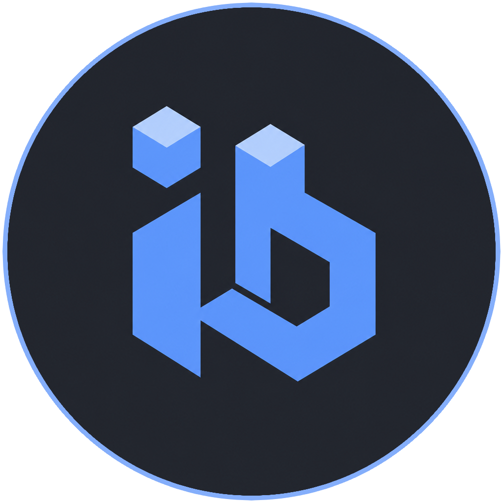

#  iBlokz IDE

Browser / Electron / Android code playground on the iBlokz stack.

**Live demo:** [iblokz.github.io/ide](https://iblokz.github.io/ide/)

Successor to earlier CodeMirror / PHP experiments, expanded from a slide-framework code sample block into a small IDE shell.

## Features

- Start screen: open a project, reopen recent folders (Electron), or try the in-memory demo
- Contenteditable editor with syntax highlighting (code-prettify) and live preview / console
- Open a local folder (desktop full FS via Electron; browser File System Access API or directory input; Android Documents workspace via Capacitor)
- File tree, open / save (when the backend is writable), recent project names
- Unsaved-change confirm on leave / window close; drag-and-drop to open files
- Resizable sidebar, editor, preview, and console panes
- Layout cycle: editor only → editor + preview → full (persisted in `localStorage`)
- Light / dark theme toggle

## Run / build matrix

| Target | Dev | Build | Deploy |
|--------|-----|-------|--------|
| Web | `pnpm start` | `pnpm build` | GitHub Pages (push to `main`/`master`) |
| Electron | `pnpm start:electron` | `./bin/build.sh --electron` | `./bin/deploy.sh --electron` (AppImage + `.desktop` in `~/.local`) |
| Android | `./bin/start.sh --android` | `./bin/build.sh --android` | `./bin/deploy.sh --android` (adb) |
| macOS / iOS | stubs (`./bin/start.sh --macos` / `--ios`) | stubs | planned |

```bash
pnpm install
pnpm start                 # web — usually http://localhost:1234
pnpm start:electron        # Parcel + Electron shell
./bin/start.sh --android   # Parcel + Capacitor live-reload on device/emulator
```

```bash
pnpm run build             # dist/ for GitHub Pages (public URL /ide/)
./bin/build.sh --electron  # dist/ (./) + Linux AppImage → artifacts/electron/
./bin/build.sh --android   # Cap sync + debug APK → artifacts/android/
pnpm run check             # Biome
pnpm run lint              # Biome + ESLint
```

### Filesystem limits

| Platform | Workspace |
|----------|-----------|
| **Electron** | Full local filesystem via native dialogs / Node FS |
| **Web** | Folder the user grants (File System Access) or a one-shot directory input (read; write depends on API support) |
| **Android (Capacitor)** | App Documents directory under `iblokz-ide` — not arbitrary device paths |

## Stack

- [Parcel](https://parceljs.org/) — bundler
- [Snabbdom](https://github.com/snabbdom/snabbdom) + [iblokz-snabbdom-helpers](https://github.com/iblokz/snabbdom-helpers) — UI
- [iblokz-state](https://github.com/iblokz/state) + RxJS — state
- Electron — desktop shell + AppImage
- Capacitor — Android APK
- File System Access API / `<input webkitdirectory>` — local projects in the browser

## Remotes

- `origin` — `git@github.com:iblokz/ide.git`
- `gitlab` — `git@gitlab.com:iblokz/ide.git`

## Versioning

SemVer + [Keep a Changelog](CHANGELOG.md). Release order: **bump `package.json` → commit → tag `vX.Y.Z`** (see [docs/RELEASE.md](docs/RELEASE.md)). Artifact names come from `package.json`, so the tag must sit on the bump commit. Pushing a `v*` tag builds AppImage/APK for the GitHub Release.

## License

This project is licensed under the **GNU Affero General Public License v3.0 (AGPL-3.0)**. See [LICENSE](LICENSE) for details.
